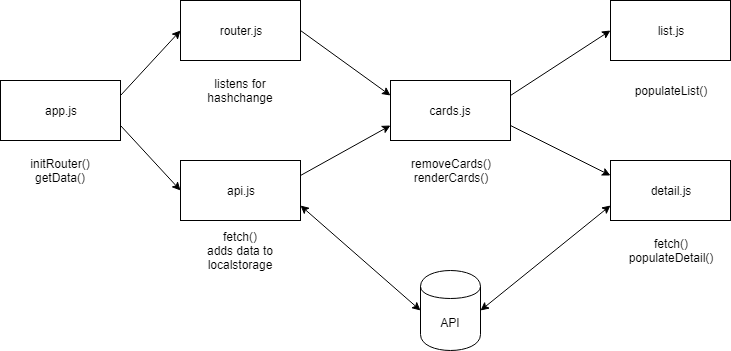

# Web App From Scratch @cmda-minor-web 18-19

In dit vak gaan we een web app maken zonder frameworks of onnodige libraries, dus zoveel mogelijk met native HTML, CSS & JavaScript. Het eindproduct is een modulair opgezet prototype voor een single page web app. Data wordt opgehaald uit een externe API, waar nodig gemanipuleerd en vervolgens getoond in de Web App. Je leert hoe je structuur aanbrengt in je code en hoe je hiermee 'from scratch' een (prototype voor een) web app maakt. Met deze kennis begrijp je daarnaast beter hoe bestaande api’s, libraries en frameworks werken.

[DEMO](https://gifted-albattani-e5c23d.netlify.com/)

## Inleiding
Mijn applicatie is een search engine waarin je alle magic kaarten op kan zoeken. Dit is in de vorm van een klein formulier met een aantal in te vullen velden. Met na het invullen van de form krijg je een selectie van de kaarten te zien die aan jouw filters voldoen. Tot een max van 100 kaarten. Deze kaarten worden opgehaald bij een API waar meer dan 10.000 kaarten op staan. Het doel van de applicatie is om de verschillende kaarten op te kunnen zoeken.

## API 

De [API](https://docs.magicthegathering.io/) die ik gebruik is de onofficiële REST interface voor Magic: The Gathering. Deze API returned maximaal 100 kaarten per call. De data die je terugkrijgt is in JSON. Je kan maximaal 5000 calls per uur doen.

##  Actor diagram

## Interaction diagram

## Designs en best Practices

Een van de best practices die ik heb gebruikt is Functional programming.

## Wishlist

- [x] Detail pagina
- [ ] Meer onderdelen in de form verwerken
- [x] Code splitsen in modules

Welke API wordt gebruikt en wat zijn de beperkingen? (rate limit)
Hoe flowed interactie door de applicatie? (interaction diagram)
Welke design patterns en best practices
Wat zou je nog willen toevoegen (feature wishlist / backlog)

## Week 2 - Design and Refactor 🛠

Doel: Breakdown maken van de web app. Routes en states toevoegen. Detailpagina renderen.

[Opdrachten](https://drive.google.com/open?id=1GMDTdW3LycAYpZSFI6gk_lrKrx8-zLWrNh69aaVEH5Y)

[Slides](https://drive.google.com/open?id=1IqQeu1m0dQiSC_KCvrn8eencAgtYe7X6qT-gm0n9Bmc)

## Week 3 - Wrapping up 🎁

Doel: Data manipuleren. Code splitsen in modules. Reflecteren op eindresultaat.

[Opdrachten](https://drive.google.com/open?id=13pKQu72pshaEzKw9q5JHLa-aop85nMP6nDCdqioWjoQ)

[Slides](https://drive.google.com/open?id=1BSzGYNLMgtHD4HRnK7f0DgyTv4Pg3xsQwD_eYNo7v0Y)

<!-- Add a link to your live demo in Github Pages 🌐-->

<!-- ☝️ replace this description with a description of your own work -->

<!-- Add a nice image here at the end of the week, showing off your shiny frontend 📸 -->

<!-- Maybe a table of contents here? 📚 -->

<!-- How about a section that describes how to install this project? 🤓 -->

<!-- ...but how does one use this project? What are its features 🤔 -->

<!-- What external data source is featured in your project and what are its properties 🌠 -->

<!-- Maybe a checklist of done stuff and stuff still on your wishlist? ✅ -->

<!-- How about a license here? 📜 (or is it a licence?) 🤷 -->
