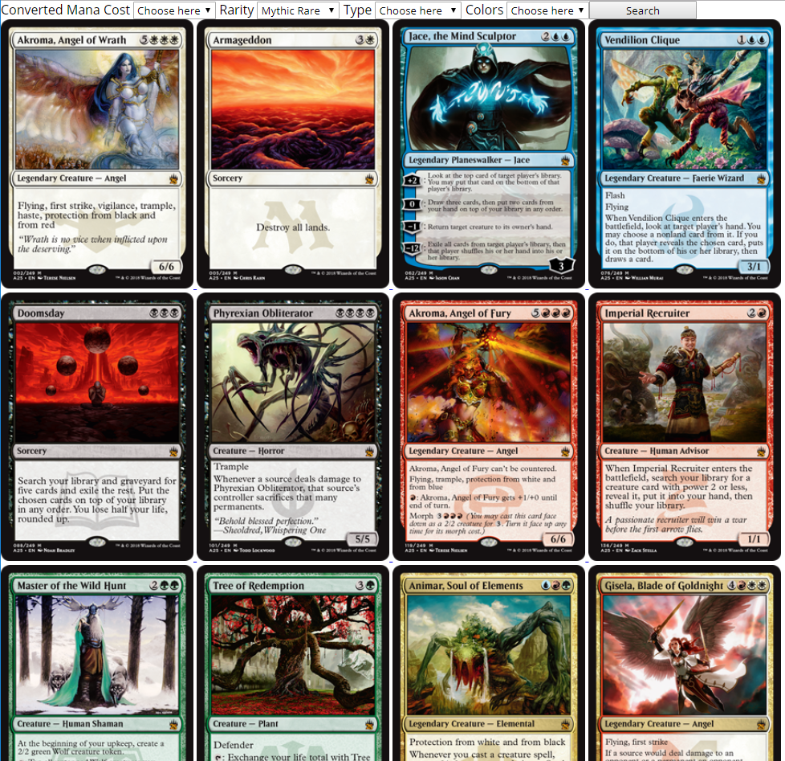

# Web App From Scratch @cmda-minor-web 18-19

In this course I'm building a web application without frameworks or unnececairy librarys. So, as much as pussible, with plain html, css and javascript. The endproduct is a modular prototype for a single-page web app. Data is called from an external API and where nececairy manipulated and rendered in the web app. I'll learn to bring structure to my code and how to build a prototype from scratch. With this knowledge I will understand better how existing API's, libraries and frameworks work.

[DEMO](https://gifted-albattani-e5c23d.netlify.com/)

## Intro
My application is a search engine wherein you can find all existing magic the gathering cards. This is done with a small form with a few fields you need to fill in. After filling in the fields you get a selection of the cards that fall within your chosen filters. Up to 100 cards are shown. These cards are requested from an API where more than 10.000 cards exist. The goal is to search through those cards.

## API 

The [API](https://docs.magicthegathering.io/) I'm using is the onofficial REST interface for Magic: The Gathering. This API returns a maximum of 100 cards per call. The data you get is JSON. There is a maximum of 5000 calls per hour.

##  Actor diagram

## Interaction diagram
.png)

## Designs en best Practices

One of the best practices I used is functional programming.

## Wishlist

- [x] Detail page
- [ ] Add more parts to the form
- [x] Separate code into modules

